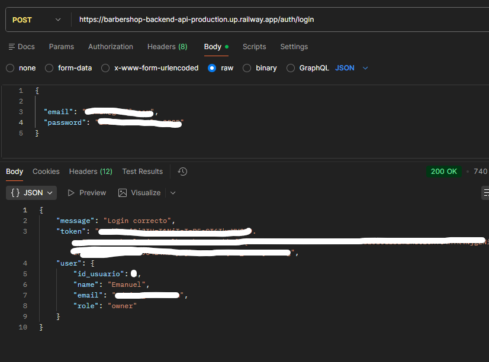
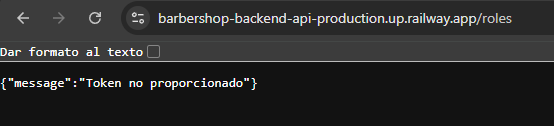
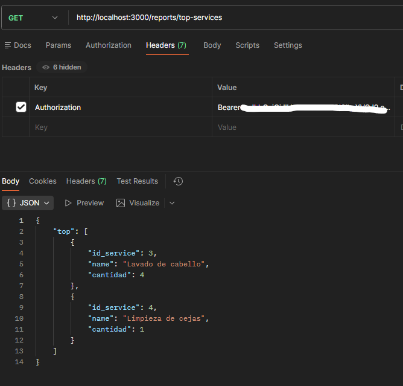
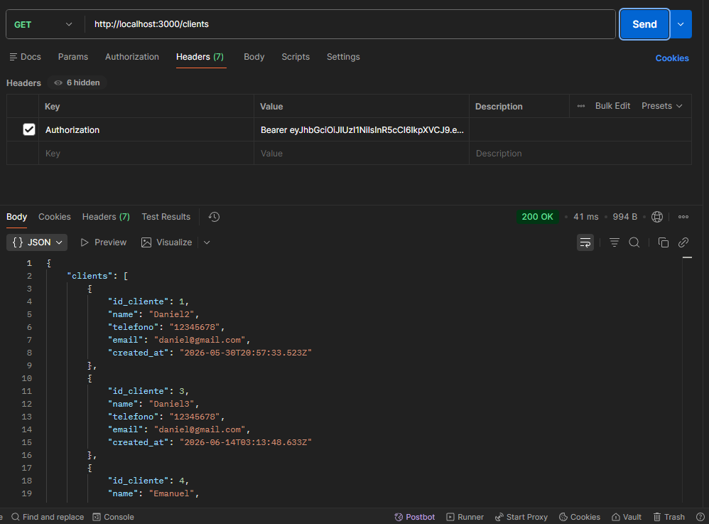
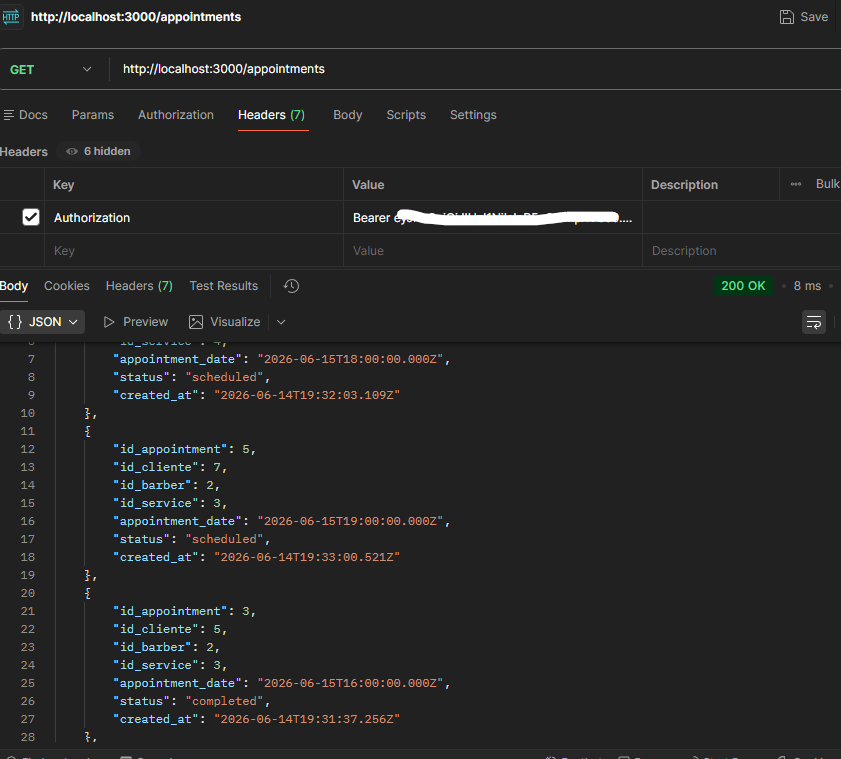

# Barber SaaS Backend


## Backend Deployment

https://barbershop-backend-api-production.up.railway.app/

REST API backend developed with a focus on **security, layered architecture, separation of concerns, business rules, and cloud deployment**.

The project implements **JWT authentication**, role-based authorization, password hashing with **bcrypt**, data validation using **Zod**, database access through **Prisma ORM**, **PostgreSQL**, **Docker** containerization, and deployment on **Railway** using **Supabase** as the production database.

---

## Main Technical Focus

* Secure authentication using JWT.
* Role-based authorization (owner, admin, and barber).
* Password protection with bcrypt.
* Data validation using Zod.
* Modular layered architecture.
* Clear separation of responsibilities between routes, middlewares, controllers, services, and repositories.
* Repository Pattern implementation.
* Service Layer implementation.
* Prisma ORM for database access and mapping.
* Business rules for appointment availability control.
* Operational reports using Prisma and SQL.
* Environment-based configuration.
* Docker containerization.
* Railway deployment.
* PostgreSQL hosted on Supabase.
* API tested with Postman.
* Git and GitHub workflow using feature branches.

---

## Technologies


---

## Architecture

The project follows a modular layered architecture to keep the code organized, scalable, and maintainable.

```txt
Client / Postman
↓
Express API Routes
↓
Middlewares
↓
Controllers
↓
Services
↓
Repositories
↓
Prisma ORM
↓
PostgreSQL
```

### Layer Responsibilities

* **Routes:** define API endpoints.
* **Middlewares:** handle authentication, role authorization, and validation.
* **Controllers:** receive HTTP requests and build responses.
* **Services:** contain business rules and validations.
* **Repositories:** centralize data access.
* **Prisma ORM:** maps application models to PostgreSQL.
* **PostgreSQL:** stores application data.

---

## Project Screenshots

### System Architecture


### Backend deployed to Railway


### Endpoint for logging into the deployed backend using Supabase cloud credentials



### Endpoint returning roles without authentication (cloud-hosted backend)



### Roles endpoint served by the cloud-hosted backend (requires a valid token).


### Endpoint returning the most requested services (requires a valid token, local environment)



### Endpoint returning clients (requires a valid token, local environment)



### Endpoint muestra citas (pasandole token valido, esta vez local)



### Endpoint returning appointments (requires a valid token, local environment)


---

## Patterns and Best Practices

* Repository Pattern.
* Service Layer.
* Layered Architecture.
* Separation of Concerns.
* Domain-based Modularization.
* Centralized Error Handling.
* Environment Variables.
* Feature Branch Workflow.

---

## Security

* JWT Authentication.
* Protected Routes.
* Authentication Middleware.
* Role-based Authorization.
* Password Hashing with bcrypt.
* Input Validation with Zod.
* Separation of Authentication and Authorization.
* Sensitive configuration kept outside the repository.

---

## Business Rules

* A barber cannot have two appointments at the same time.
* Appointments use controlled states: scheduled, completed, and cancelled.
* Clients, barbers, and services are validated before creating or updating records.
* Reports are restricted to owner and admin users.

---

## Main Modules

* Auth
* Users
* Roles
* Clients
* Services
* Barbers
* Appointments
* Reports

---

## Main Endpoints

Most endpoints require JWT authentication.

### Auth

```txt
POST /auth/login
GET  /auth/me
```

### Users

```txt
POST   /users
GET    /users
GET    /users/:id
PUT    /users/:id
DELETE /users/:id
```

### Roles

```txt
GET /roles
```

### Services

```txt
POST   /services
GET    /services
GET    /services/:id
PUT    /services/:id
DELETE /services/:id
```

### Clients

```txt
POST   /clients
GET    /clients
GET    /clients/:id
PUT    /clients/:id
DELETE /clients/:id
```

### Barbers

```txt
POST   /barbers
GET    /barbers
GET    /barbers/:id
PUT    /barbers/:id
DELETE /barbers/:id
```

### Appointments

```txt
POST   /appointments
GET    /appointments
GET    /appointments/:id
PUT    /appointments/:id
DELETE /appointments/:id
```

### Reports

```txt
GET /reports/appointments-by-status
GET /reports/top-services
GET /reports/top-barbers
GET /reports/revenue
```

---

## Available Reports

* Appointments grouped by status.
* Most requested services.
* Top barbers by appointments.
* Total revenue from completed appointments.

---

## Deployment

```txt
GitHub Repository
↓
Dockerfile
↓
Railway Deployment
↓
Supabase PostgreSQL
```

---

## Docker

Main files:

* `Dockerfile`
* `docker-compose.yml`
* `.dockerignore`
* `.env.example`

---

## Project Status

Current Status: **Functional**

Implemented Features:

* JWT Authentication.
* Role-based Authorization.
* User CRUD.
* Client CRUD.
* Service CRUD.
* Barber CRUD.
* Appointment Management.
* Operational Reports.
* Docker Support.
* Railway Deployment.
* PostgreSQL Database.
* Supabase Integration.
 