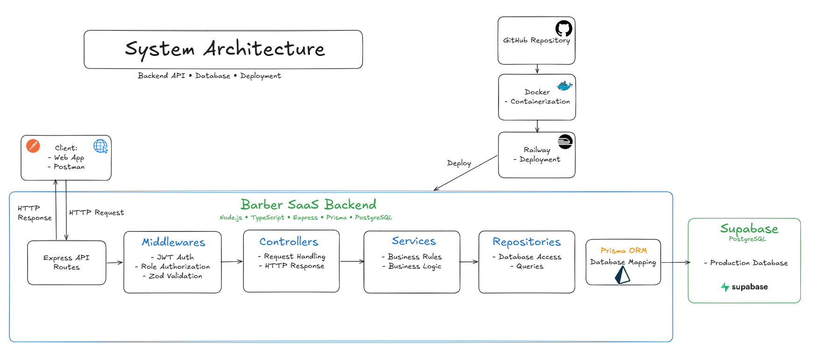
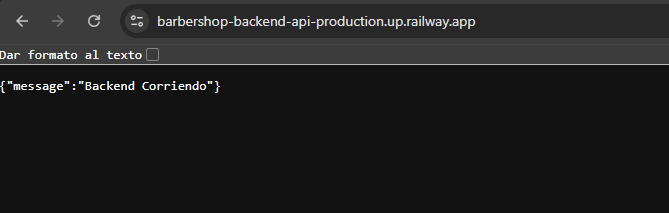
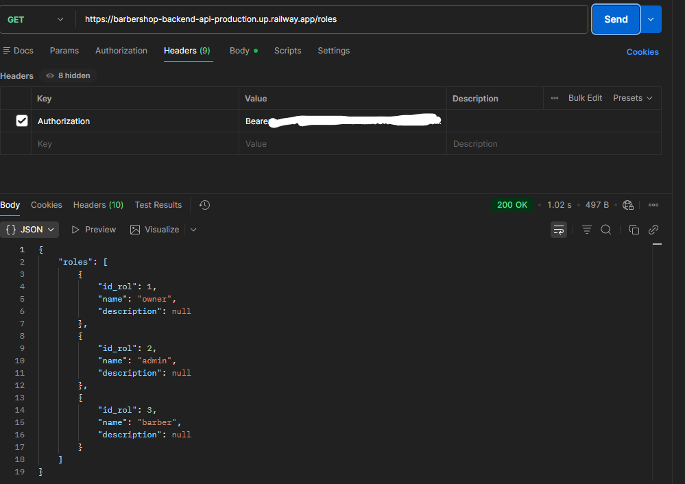

# Barber SaaS Backend



Backend desplegado: 
https://barbershop-backend-api-production.up.railway.app/
Backend REST API desarrollado con enfoque en **seguridad, arquitectura por capas, separación de responsabilidades, reglas de negocio y despliegue en la nube**.

El proyecto implementa autenticación con **JWT**, autorización por roles, hash de contraseñas con **bcrypt**, validación de datos con **Zod**, acceso a datos mediante **Prisma ORM**, base de datos **PostgreSQL**, contenedorización con **Docker** y despliegue en **Railway** utilizando **Supabase** como base de datos en producción.

---

## Enfoque técnico principal

* Autenticación segura mediante JWT.
* Autorización basada en roles (owner, admin y barber).
* Contraseñas protegidas con bcrypt.
* Validación de datos con Zod.
* Arquitectura modular por capas.
* Separación clara de responsabilidades entre routes, middlewares, controllers, services y repositories.
* Implementación de Repository Pattern.
* Implementación de Service Layer.
* Prisma ORM para acceso y mapeo de datos.
* Reglas de negocio para control de disponibilidad de citas.
* Reportes operativos utilizando Prisma y SQL.
* Configuración mediante variables de entorno.
* Contenedorización con Docker.
* Despliegue en Railway.
* PostgreSQL desplegado en Supabase.
* API documentada y probada con Postman.
* Flujo de trabajo con Git y GitHub utilizando ramas por funcionalidad.

---

## Tecnologías utilizadas


---

## Arquitectura

El proyecto utiliza una arquitectura modular por capas para mantener el código organizado, escalable y fácil de mantener.

```txt
Client / Postman
↓
Express API Routes
↓
Middlewares
↓
Controllers
↓
Services
↓
Repositories
↓
Prisma ORM
↓
PostgreSQL
```

### Responsabilidad de cada capa

* **Routes:** definen los endpoints de la API.
* **Middlewares:** gestionan autenticación, autorización por roles y validación de datos.
* **Controllers:** reciben las solicitudes HTTP y construyen las respuestas.
* **Services:** contienen reglas de negocio y validaciones principales.
* **Repositories:** centralizan el acceso a los datos.
* **Prisma ORM:** mapea los modelos de la aplicación hacia PostgreSQL.
* **PostgreSQL:** almacena la información del sistema.

---

## Capturas del proyecto

### Arquitectura del sistema


### Backend desplegado




### Endpoint muestra de roles



---

## Patrones y buenas prácticas aplicadas

* Repository Pattern.
* Service Layer.
* Arquitectura por capas.
* Separación de responsabilidades.
* Modularización por dominio.
* Manejo centralizado de errores.
* Uso de variables de entorno.
* Desarrollo mediante ramas de funcionalidad en Git.

---

## Seguridad

* Login mediante JWT.
* Protección de rutas privadas.
* Middleware de autenticación.
* Middleware de autorización por roles.
* Contraseñas protegidas mediante bcrypt.
* Validación de entrada mediante Zod.
* Separación entre autenticación y autorización.
* Variables sensibles fuera del repositorio.

---

## Reglas de negocio

* Un barbero no puede tener dos citas en el mismo horario.
* Las citas manejan estados controlados: scheduled, completed y cancelled.
* Se valida la existencia de clientes, barberos y servicios antes de crear o actualizar registros.
* Los reportes están restringidos a usuarios owner y admin.

---

## Módulos principales

* Auth
* Users
* Roles
* Clients
* Services
* Barbers
* Appointments
* Reports

---

## Endpoints principales

La mayoría de endpoints requieren autenticación mediante JWT.

### Auth

```txt
POST /auth/login
GET  /auth/me
```

### Users

```txt
POST   /users
GET    /users
GET    /users/:id
PUT    /users/:id
DELETE /users/:id
```

### Roles

```txt
GET /roles
```

### Services

```txt
POST   /services
GET    /services
GET    /services/:id
PUT    /services/:id
DELETE /services/:id
```

### Clients

```txt
POST   /clients
GET    /clients
GET    /clients/:id
PUT    /clients/:id
DELETE /clients/:id
```

### Barbers

```txt
POST   /barbers
GET    /barbers
GET    /barbers/:id
PUT    /barbers/:id
DELETE /barbers/:id
```

### Appointments

```txt
POST   /appointments
GET    /appointments
GET    /appointments/:id
PUT    /appointments/:id
DELETE /appointments/:id
```

### Reports

```txt
GET /reports/appointments-by-status
GET /reports/top-services
GET /reports/top-barbers
GET /reports/revenue
```

---

## Reportes disponibles

* Citas agrupadas por estado.
* Servicios más utilizados.
* Barberos con más citas.
* Ingresos totales por citas completadas.

---

## Despliegue

```txt
GitHub Repository
↓
Dockerfile
↓
Railway Deployment
↓
Supabase PostgreSQL
```

---

## Docker

Archivos principales:

* `Dockerfile`
* `docker-compose.yml`
* `.dockerignore`
* `.env.example`

---

## Estado del proyecto

Estado actual: **Funcional**

Características implementadas:

* Autenticación JWT.
* Autorización por roles.
* CRUD de usuarios.
* CRUD de clientes.
* CRUD de servicios.
* CRUD de barberos.
* Gestión de citas.
* Reportes operativos.
* Docker.
* Railway.
* PostgreSQL.
* Supabase.
